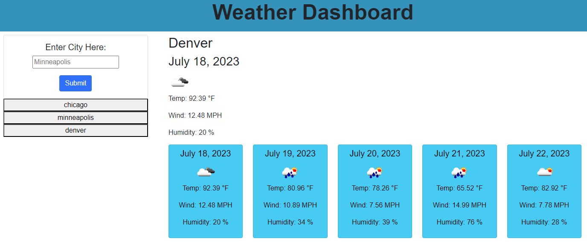

# Weather Dashboard: Server Side APIs

A weather dashboard that will give current and 5-day forecasts and save previous searches.

## Purpose of Assignment
 - This module's challenge focused on building a weather dashboard site with server-side APIs.
 - The weather dashboard starts with a blank screen and search form for the user to input any US city of their choice.
 - Upon searching for a city, a daily and 5-day forecast is displayed and the searched city is saved in local storage and displayed as a button for the user to easily re-look up the weather conditions for that city. 
 - Both the daily and 5-day forecasts display the date, temperature, windspeed, humidity, and display an icon for cloud cover. 

## Instructions for the User
 - Please use website and comment on any errors 

## Screen Shot of Working Website

## Link to Working Version of Code
[Click Here to View Webpage](https://aidan-windebank.github.io/weather-dashboard/)